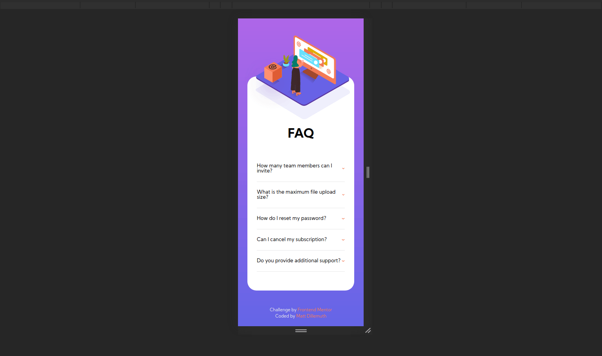

# Frontend Mentor - FAQ Accordion Card

The following is my genuine and personalized solution to the Frontend Mentor challenge, [FAQ Accordion Card](https://www.frontendmentor.io/challenges/faq-accordion-card-XlyjD0Oam).

- Responsive accordion card component implemented with vanilla HTML, CSS, and JS.
- Developed from design assets provided by Frontend Mentor

## Motivation

- To practice creating the front-end of a professional-quality design without the use of a tutorial, answer-key, or previous solution.
- To practice following a style-guide and implementing assets from a designer
- To practice implementing functional components in vanilla Javascript

## Showcase

## Technology

- HTML5
- SCSS & CSS3
- Javascript
- Figma
